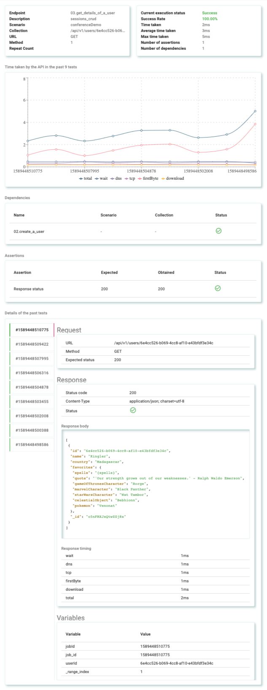

# Reports

Vibranium supports multiple reporting formats. All of these reports will be available inside the **jobs** directory inside the workspace, inside the **latest** as well as **job number** directories.

Vibranium also provides a report UI that contains all previous execution details.

## Sample response

